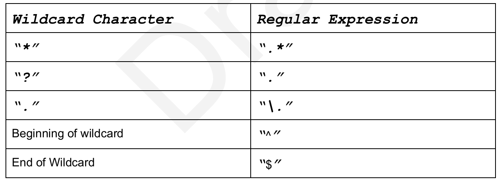
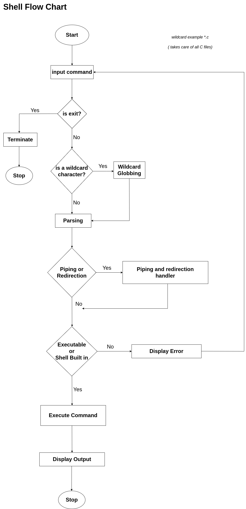

simple_shell project repository
===============================

This repository contains the files for ALX's **simple_shell**. It can be compiled using GCC and will execute a simple shell that can be used for some basic tasks and programs most commonly found in the /bin/ folder.

# Pre-requisites

### Authorized functions and macros

- access (man 2 access)
- chdir (man 2 chdir)
- close (man 2 close)
- closedir (man 3 closedir)
- execve (man 2 execve)
- exit (man 3 exit)
- _exit (man 2_exit)
- fflush (man 3 fflush)
- fork (man 2 fork)
- free (man 3 free)
- getcwd (man 3 getcwd)
- getline (man 3 getline)
- isatty (man 3 isatty)
- kill (man 2 kill)
- malloc (man 3 malloc)
- open (man 2 open)
- opendir (man 3 opendir)
- perror (man 3 perror)
- read (man 2 read)
- readdir (man 3 readdir)
- signal (man 2 signal)
- stat (__xstat) (man 2 stat)
- lstat (__lxstat) (man 2 lstat)
- fstat (__fxstat) (man 2 fstat)
- strtok (man 3 strtok)
- wait (man 2 wait)
- waitpid (man 2 waitpid)
- wait3 (man 2 wait3)
- wait4 (man 2 wait4)
- write (man 2 write)

### GCC command to compile

`
gcc -Wall -Werror -Wextra -pedantic *.c -o hsh
`

This wil compile all the '.c' files and change the output's name to 'hsh'.

### Template to test output

=============
$ ./hsh

($)

hsh main.c shell.c

$ exit
$

After you clone this repository and compile the program with the command above, you will generate a file called **hsh** that can be executed by entering  ```./hsh``` in your shell.

The output after the program is executed should look something like this:

```
$|
```

Where you will get a prompt in the shape of a dollar sign so you can start typing commands into your shell.  Agood example of how it should execute is the command shown above were the user enters 'ls' and then gets a list of the directory contents.

### Parts of a Shell Program

The shell implementation is divided into three parts: ​

`The Parser`​
`The Executor`​
`Shell Subsystems`

## The Parser

The Parser is the software component that reads the command line such as “ls ­al” and puts it into a data structure called Command Table ​that will store the commands that will be executed.

## The Executor

The executor will take the command table generated by the parser and for every SimpleCommand in the array it will create a new process. It will also if necessary create pipes to communicate the output of one process to the input of the next one. Additionally, it will redirect the standard input, standard output, and standard error if there are any redirections.

## Shell Subsystems

`Enviroment Variables`: Expressions of the form${VAR} are expanded with the corresponding environment variable. Also the shell should be able to set, expand and print environment vars.

`Wildcards`: Arguments of the form a*a anre expanded to all the files that match them in the local directory and in multiple directories.

`Subshells`: Arguments between "" (backticks) are executed and the output is sent as input to the shell.

## Builtin Functions

All built-in functions except printenv are executed by the parent process. The reason for this is that we want setenv, cd etc to modify the state of the parent. If they are executed by the child, the changes will go away when the child exits. For this built in functions, call the function inside execute instead of forking a new process.

## Implementing the wildcard in shell

No shell is complete without wildcards. Wildcards is a Shell feature that allows one single commend
to be performed on multiple files that match the wildcard.

A wildcard describes filenames that match the wildcard. A wildcard works by iterating over all
the files in the current directory or the directory described in the wildcars and then as
arguments to the command those filenames that match the wildcard.

In general, the "*" character matches 0 or more characters of any type. The character "?"
matches one character of any type.

To implement a wildcard, you should first translate the wildcard to a regular expression that a
regular expression library can evaluate.

We suggest to implement first the simple case where you expand wildcards in the current directory.

| Wildcard Character | Regular Expression |
|--------------------|:------------------:|
|          "?"       |         "."        |
|          "."       |         "\."       |
|Beginning of Wildcard |       "^"        |
|End of Wildcard      |        "$"        |



## General Flow Chart



## Linked in Reference

[Linked In](https://link-url-here.org)

### Contact Info

Git: [Murugi Nthakanio](https://github.com/codebyrugi), [Dennis Nderitu](https://github.com/dennisnderitu254)

# Tasks

## Task 1

Check shell_loop.c , loophsh.c

## Task 2

getline.c

## Task 3

File - parser.c
find_path - finds this cmd in the PATH string

## Task 4

File - builtin.c
_myexit - exits the shell

## Task 5

Simple shell 0.4 +
Implement the env built-in, that prints the current environment
File - environ.c
_myenv  - prints the current environment
_getenv - gets the value of an environ variable
_mysetenv - Initialize a new environment variable, or modify an existing one
_myunsetenv - Remove an environment variable
Populate_env_list - populates env linked list

File - getenv.c
get_environ - returns the string array copy of our environ
_unsetenv - Remove an environment variable
_setenv - Initializes a new environment variable, or modify an existing one

## Task 6
